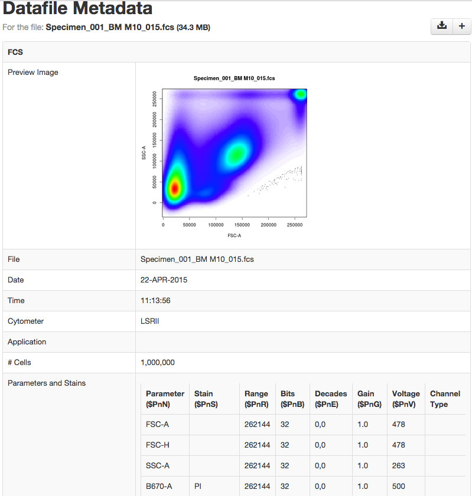

FCS Preview Image And Metadata Extraction MyTardis Filter
=========================================================

Filter for generating image thumbnails and extracting metadata from FCS files
for MyTardis using Bioconductor's flowCore and flowViz packages.



## Requirements
 - R (http://www-r-project.org/)
 - flowCore (http://www.bioconductor.org/packages/release/bioc/html/flowCore.html)
 - flowViz (http://www.bioconductor.org/packages/release/bioc/html/flowViz.html)
 - rpy2 (http://rpy.sourceforge.net/)
   - Future versions may use littler (http://dirk.eddelbuettel.com/code/littler.html) instead.
 - ImageMagick (http://www.imagemagick.org/script/command-line-tools.php)
 - [MyTardis 3.6](https://github.com/mytardis/mytardis/branches/3.6)
   plus a small change to allow HTML tables in datafile metadata to be marked safe to render.

## Installation

 - Install ImageMagick, using ```sudo apt-get install imagemagick```

Git clone this repository into `/path/to/mytardis/tardis/tardis_portal/filters`:
    
    git clone git@github.com:wettenhj/fcs-mytardis-filter.git fcs

Add the following to your MyTardis settings file eg. `/path/to/mytardis/tardis/settings.py`

```
MIDDLEWARE_CLASSES = MIDDLEWARE_CLASSES + ('tardis.tardis_portal.filters.FilterInitMiddleware',)

FILTER_MIDDLEWARE = (("tardis.tardis_portal.filters", "FilterInitMiddleware"),)
```

The above enables the filter middleware for all actions.

Then add the definition for this filter.

```
POST_SAVE_FILTERS = [
   ("tardis.tardis_portal.filters.fcs.fcs.make_filter",
   ["FCS", "http://tardis.edu.au/schemas/fcs/1",
    "/path/to/mytardis/tardis/tardis_portal/filters/fcs/bin/fcsplot"])
   ]
```
`cd /path/to/mytardis` and load the parameter schema into the MyTardis database:

```
python mytardis.py loaddata tardis/tardis_portal/filters/fcs/fcs.json
```

Restart MyTardis.
